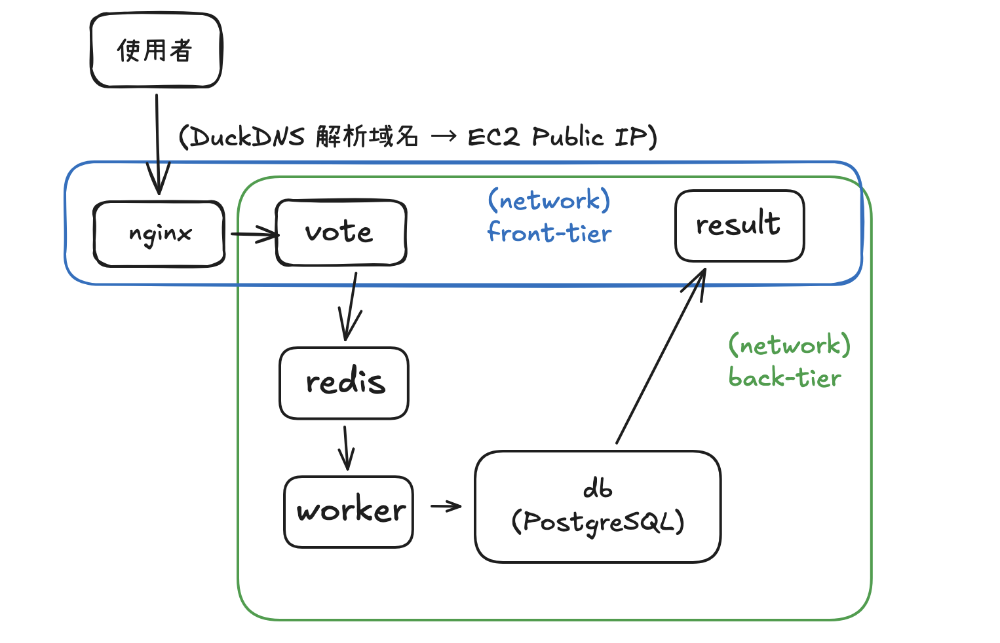
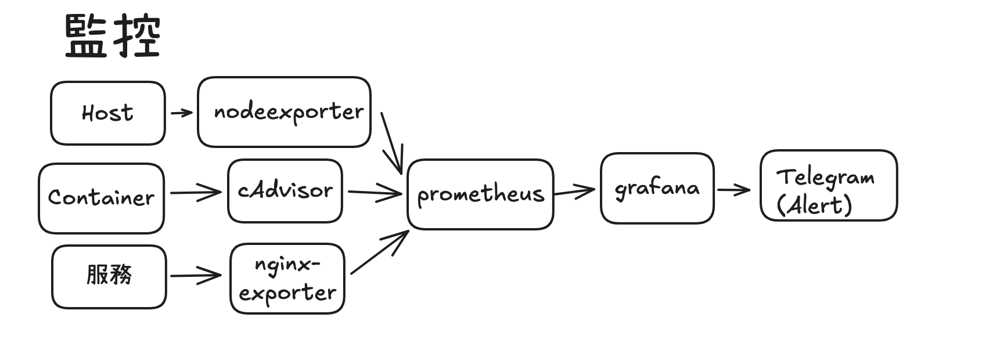
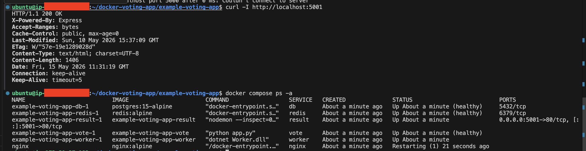
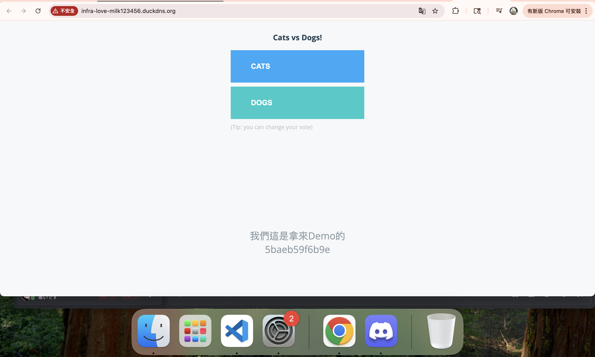
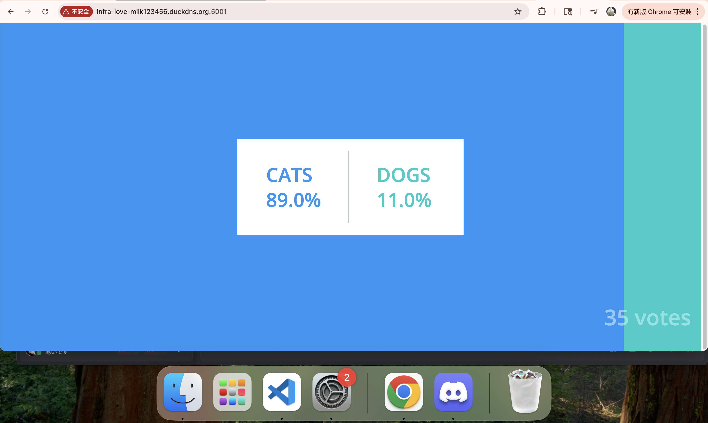
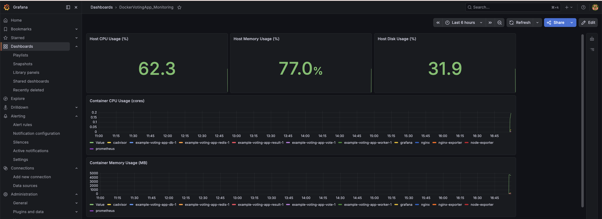
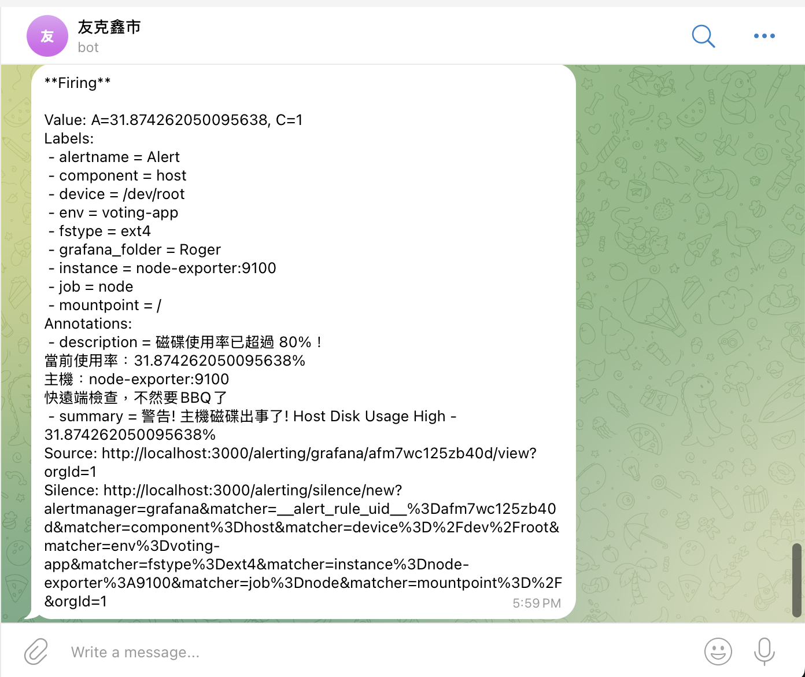

# Docker Voting App 維運實作專案
在 AWS EC2 t3.small的單機環境下，建置基礎維運架構的服務；    
使用 Docker Compose 多服務部署、Nginx 反向代理、監控告警與 GitHub Actions的CI/CD；    
記錄設計思路及維運問題排除流程，盡量貼近實務狀況，提高解決問題的能力。    


# 技術棧

<table>
  <thead>
    <tr>
      <th style="width: 45%;">技術 / 工具</th>
      <th style="width: 55%;">備註</th>
    </tr>
  </thead>
  <tbody>
    <tr>
      <td>AWS EC2 (t3.small) + Docker Compose</td>
      <td>單機環境下完成 Docker Compose 的多服務部署、資源限制、健康檢查與網路隔離</td>
    </tr>
    <tr>
      <td>Nginx 反向代理</td>
      <td>單一入口流量管理</td>
    </tr>
    <tr>
      <td>Prometheus + Grafana + Exporters</td>
      <td>監控 主機 / 容器 / Nginx 並於 Telegram 做即時告警</td>
    </tr>
    <tr>
      <td>GitHub Actions CI/CD</td>
      <td>自動化部署、透過 SHA tag 版本控制與快速退版機制</td>
    </tr>
  </tbody>
</table>

# Demo
- 投票頁面 : [http://infra-love-milk123456.duckdns.org](url)
- 結果頁面 : [http://infra-love-milk123456.duckdns.org:5001](url)
- GitHub Repo： [連結](https://github.com/Yoyoisadog/BasicInfraSideProject)   

**注意事項**    
- 可直接投票，結果會**實時更新**  

# 架構圖
   
 

# 實作細節
## 目錄
1. AWS EC2 租借機器並設定SecurityGroup
2. Docker Compose啟動多容器服務
3. Nginx 反向代理
4. 實作 exporter/prometheus/grafana 進行監控
5. 透過 github action 做基礎CI/CD

## AWS EC2環境準備
### 設計思路
使用的是AWS免費方案，機器選用 t3.small，作業系統使用Ubuntu。    
開發方式用SSH + VS Code Remote-SSH連線進行部署作業。
### 重點調整
需要特別紀錄的僅有Security Group，因為一開始很多次問題排除到最後發現是防火牆問題。    
這邊有預先設計好開放特定端口，方便後續驗證使用。
<table>
  <thead>
    <tr>
      <th style="width: 8%; text-align: center;">端口</th>
      <th style="width: 8%; text-align: center;">協議</th>
      <th style="width: 18%; text-align: center;">來源</th>
      <th style="width: 38%;">用途</th>
      <th style="width: 28%;">備註</th>
    </tr>
  </thead>
  <tbody>
    <tr>
      <td style="text-align: center;">22</td>
      <td style="text-align: center;">TCP</td>
      <td style="text-align: center;">My IP</td>
      <td>SSH 連線</td>
      <td>為了安全性只允許本機 IP</td>
    </tr>
    <tr>
      <td style="text-align: center;">80</td>
      <td style="text-align: center;">TCP</td>
      <td style="text-align: center;">0.0.0.0/0</td>
      <td>Nginx 反向代理（對外入口）</td>
      <td></td>
    </tr>
    <tr>
      <td style="text-align: center;">5000</td>
      <td style="text-align: center;">TCP</td>
      <td style="text-align: center;">0.0.0.0/0</td>
      <td>vote 服務（測試用）</td>
      <td></td>
    </tr>
    <tr>
      <td style="text-align: center;">5001</td>
      <td style="text-align: center;">TCP</td>
      <td style="text-align: center;">0.0.0.0/0</td>
      <td>result 服務（測試用）</td>
      <td></td>
    </tr>
    <tr>
      <td style="text-align: center;">3000</td>
      <td style="text-align: center;">TCP</td>
      <td style="text-align: center;">My IP</td>
      <td>Grafana 儀表板</td>
      <td></td>
    </tr>
    <tr>
      <td style="text-align: center;">9090</td>
      <td style="text-align: center;">TCP</td>
      <td style="text-align: center;">My IP</td>
      <td>Prometheus UI</td>
      <td></td>
    </tr>
  </tbody>
</table>


   

## Docker Compose 多服務部署

### 目標
透過改造官方DockerVotingAPP的原生yaml檔案，使用```docker ps```指令一鍵啟動所有服務。   
此階段要確保設定符合維運的基礎條件，包含網路隔離、健康檢查、依賴關係、資源控制與資料持久化。   

### 設計思路
<table>
  <thead>
    <tr>
      <th style="width: 18%;">項目</th>
      <th style="width: 52%;">處理方式</th>
      <th style="width: 30%;">備註</th>
    </tr>
  </thead>
  <tbody>
    <tr>
      <td>網路隔離</td>
      <td>network區分內網/外網</td>
      <td>為了解決安全性問題，vote/result暴露必要端口，db/redis/worker只有內網</td>
    </tr>
    <tr>
      <td>健康檢查</td>
      <td>db, vote, result, redis 需要撰寫腳本確認容器啟動後的服務是正常的</td>
      <td>db和redis的腳本較為複雜，會掛載獨立的檔案</td>
    </tr>
    <tr>
      <td>資源限制</td>
      <td>每個服務都要設定資源限制</td>
      <td>t3.small 記憶體有限，資源不限制好會因為太多程序而當機</td>
    </tr>
    <tr>
      <td>資料持久化</td>
      <td>PostgreSQL 使用 named volume</td>
      <td>投票資料要確保不會遺失，符合實務情境</td>
    </tr>
    <tr>
      <td>開發體驗</td>
      <td>vote / result 使用 volume 掛載Host的資料夾</td>
      <td>更改前端程式碼即刻生效，不用重新 build，有效降低 Loading</td>
    </tr>
    <tr>
      <td>依賴關係</td>
      <td>vote需要等redis啟動，worker需要等db和redis啟動，result需要等db啟動</td>
      <td>寫好依賴服務通過健康檢查後，才啟動下一個服務，確保啟動成功</td>
    </tr>
  </tbody>
</table>

### 調整重點
- 我移除了Swarm專用的 `deploy:` 區塊，因為是使用Docker compose
- 我為了確保執行中資料不會因關閉容器遺失，自動重啟確保服務持續，每個服務都加上`restart: unless-stopped` + `stop_grace_period`。
- vote/result在此階段都會先暴露port，以利階段性驗證。後續新增nginx後，會移除暴露的port。

### 文件查看
[🫵 點我前往查看compose.yml](./docker-compose.yml)
### 問題紀錄

1. **t3.small 部署後 SSH 直接斷線**   
原因：docker stats顯示記憶體使用率超過90%，導致SSH直接斷線    
解決：   
機器的總記憶體為 2GB，所以要預留1GB給後續的監控服務和其他系統。    
針對 vote、result、worker、db、redis 等服務逐一設定 `cpus` 與 `memory` 的限制規則，加起來不能夠超過1GB。
   ```
   # 查詢目前記憶體用量，發現使用量高於90%
   docker stats --no-stream
   docker compose logs --tail=50

   # 為每個服務加上限制
   deploy:
      resources:
        limits:
          cpus: '0.4'
          memory: 256M
   
   # 快速查看限制設定
   cat docker-compose.yml | grep -A 5 -B 2 "limits:"

   # 重啟容器確認記憶體狀況
   docker compose down
   docker compose up -d
   ```

2. Security Group 設定錯誤導致本機無法連線   
原因：本機連線 http://15.168.76.39:5000 時一直沒有回應，判斷是TimeOut。   
解決 : 逐步確認容器狀態/Port端口/本機Curl測試後，定位問題是在防火牆部分，至AWS的SecuirtyGroup調整Inbound Rule後正常。
   ```
   # 確認容器狀態
   docker compose ps

   # 確認主機端口是否開放
   ss -tlnp | grep 5000

   # 於AWS EC2測試容器是否正常
   curl -I http://localhost:5000

   # 做完以上排錯後，判斷問題應為防火牆
   # 於AWS頁面更改Scurity Group的Inbound rule (TCP/5050/MyIP)
   # 於本機連線網頁確認是否正常，若正常代表問題解決
   http://15.168.76.39:5000

   ```
### 常用排查指令
```bash
# 查容器現在的狀況和log
docker compose ps -a
docker compose logs -f <service>
docker compose logs --tail=200 <service>
docker compose logs -t <service>

# 直接執行健康檢查腳本測試
docker exec -it redis redis-cli ping
docker exec -it db psql -U postgres -c "SELECT 1;"

# 網路與端口檢查
ss -tlnp
curl -I http://localhost:5000
curl -I http://localhost:5001

```
▽ 驗證 : 確認網頁服務正常，Container 運作順利

## Nginx 反向代理

### 目標
使用Nginx當單一對外入口，並加上對應域名綁定，以及upstream的設定。    

### 設計思路

<table>
  <thead>
    <tr>
      <th style="width: 18%;">項目</th>
      <th style="width: 47%;">處理方式</th>
      <th style="width: 35%;">備註</th>
    </tr>
  </thead>
  <tbody>
    <tr>
      <td>單一入口</td>
      <td>Nginx監聽80Port，並把流量轉給vote</td>
      <td>取代原本vote端口直接暴露在外的問題</td>
    </tr>
    <tr>
      <td>網路整合</td>
      <td>Nginx 加入 front-tier</td>
      <td>讓 nginx 可以連到 vote</td>
    </tr>
    <tr>
      <td>Upstream 設定</td>
      <td>使用 upstream 區塊定義 vote_backend</td>
      <td>為之後的水平擴展做準備</td>
    </tr>
    <tr>
      <td>域名綁定</td>
      <td>使用 DuckDNS 取得免費域名</td>
      <td>貼近實務狀況，透過網址連線</td>
    </tr>
    <tr>
      <td>result 暫時開放 5001 port</td>
      <td>result 暴露 port 5001</td>
      <td>result 專案預設假設自己是 root 目錄，proxy 到"/"會導致讀取不到 CSS 而跑版</td>
    </tr>
  </tbody>
</table>

### 調整重點
- dockercompose.yml文件中的vote區塊要移除 `ports:`，後續由nginx代理
- result 服務因跑版問題，暫時保留 `ports: "5001:80"`，當作過渡方案
- Nginx 要把設定檔 `nginx/conf.d` 掛進容器
- 因為vote和result啟動後，Nginx才能正常服務，所以增加  `depends_on: vote` 和 `result`
- nginx.conf 新增安全性標頭確保基本安全性（X-Frame-Options、X-XSS-Protection ）

### 文件查看
[點我查看compose.yml確認nginx區塊](./docker-compose.yml)   
[點我查看nginx設定文件](./nginx/conf.d/default.conf)

### 問題機錄  
1. 網頁一直顯示502   
原因：查nginx的log得到錯誤訊息"upstream connect failed"    
解決：透過在 vote 服務加上 depends_on: service_healthy，確保容器真的有提供服務後才轉發流量
   ```
   # 查nginx log
   docker compose logs -f nginx
   # 確認nginx文件的upstream區塊，發現是接到vote
   docker exec -it nginx cat /etc/nginx/conf.d/default.conf
   # 確認vote狀態
   docker compose ps
   docker inspect vote --format '{{.State.Health.Status}}'

   # 發現vote卡在starting
   # 代表nginx一直轉發流量，但是vote還沒準備好
   # 於yml檔案加上等健康檢查通過後再運作
   depends_on:
      redis:
        condition: service_healthy

   ```
2. result 根目錄衝突導致網頁嚴重跑版   
原因：打開result網頁發現CSS跑版   
解決：讓result暫時使用ports: "5001:80" 端口連線，要從根源修正需要更改程式碼，因為本次專案是為了做維運練習，所以使用暴露端口方式處理。
   ```
   # 一開始是打算將nginx當單一入口，反向代理vote和result
   # 確認location確實有掛到result
   docker exec -it nginx cat /etc/nginx/conf.d/default.conf

   # 進入result容器查詢
   docker exec -it result cat /usr/local/app/index.html | grep -E 'src|href'

   # 發現都是寫死的絕對路徑
   # 代表result程式碼從一開始就假設自己是根目錄（/），它不支援被放到 /result 子路徑下
   /styles.css
   /js/app.js
   /api/results

   # 修改程式碼並非本次專案目標，決定重新開啟result的port
   # 於compose.yml文件重新加上這段
   ports:
      - "5001:80"  
   ```
### 常用指令
```bash
#確認log
docker compose logs -f nginx
docker compose logs --tail=200 nginx

#檢查和重讀nginx
docker exec -it nginx nginx -t
docker exec -it nginx nginx -s reload

#本機測試連線是否正常
curl -I http://localhost
curl -I http://localhost:5001
curl -I http://infra-love-milk123456.duckdns.org

#確認端口和nginx文件設定
ss -tlnp
docker exec -it nginx cat /etc/nginx/conf.d/default.conf
```
 - 本機可以連線上網站
   
 - 投票之後票數會變動
   

## 監控(Monitoring)

### 目標
成功部署 Prometheus + 多個 exporter + Grafana，告警發生時要打到TG。    
在建置階段，監控系統必須涵蓋 主機 / Container / 服務 的各項指標，確保順利維運。

### 設計思路

<table>
  <thead>
    <tr>
      <th style="width: 20%;">項目</th>
      <th style="width: 50%;">處理方式</th>
      <th style="width: 30%;">備註</th>
    </tr>
  </thead>
  <tbody>
    <tr>
      <td>獨立文件</td>
      <td>使用新的一份 <code>compose.yml</code></td>
      <td>與主要服務分開，避免同時啟動當機，以及方便管理</td>
    </tr>
    <tr>
      <td>監控層級</td>
      <td>node-exporter（主機） + cAdvisor（容器） + nginx-exporter（Nginx）</td>
      <td>在建置階段會使用三層監控，但實際階段僅保留node-exporter，原因為t3.small的記憶體僅有2G做的取捨。</td>
    </tr>
    <tr>
      <td>Prometheus</td>
      <td>scrape_configs 設定三個任務，每 30s 抓取一次</td>
      <td>將所有需要的資訊透過 Prometheus 蒐集</td>
    </tr>
    <tr>
      <td>Grafana</td>
      <td>連線 Prometheus 取得資料，並客製化監控頁面</td>
      <td>繪製成方便好理解的圖表</td>
    </tr>
    <tr>
      <td>Alert 通知</td>
      <td>Grafana Alerting 打通 Telegram</td>
      <td>有問題就傳到通訊軟體，符合實務狀況</td>
    </tr>
  </tbody>
</table>

### 調整重點    
- 建立monitoring資料夾，使用獨立compose文件
- Prometheus的設定要掛載 `prometheus.yml`
- 監控相關都使用 `monitoring` 網路
- Grafana 要做持久化確保 Dashboard 不會遺失
- Grafana 的 Dashboard 手動新增Ｑuery，理解監控如何設置
- 避免t3.small當機，cAdvisor/nginx exporter實際部署時會停用

### 文件查看
[點我查看 monitoring.yml 設定檔](./monitoring/docker-compose.yml)     
[點我查看 prometheus.yml 設定檔](./monitoring/prometheus/prometheus.yml)     
### 問題紀錄   
1. nginx連線數
原因：透過grafana發現沒有任何nginx連線數的數據   
解決：在 nginx.conf 補上 /stub_status location 區塊，確保抓得到資料。   
   ```
   # 確認nginx-exporter是否有在運作
   docker compose ps | grep nginx-exporter

   # 確認exporter 有沒有抓到 nginx 資料
   curl -I http://localhost:9113/metrics | grep nginx

   # 查看nginx設定檔，發現沒有/stub_status區塊
   docker exec -it nginx cat /etc/nginx/conf.d/default.conf

   # 於設定檔補上/stub_status區塊
       location /stub_status {
    stub_status on;
    access_log off;
    allow 127.0.0.1;
    allow ::1;
    deny all;
    }

   # 重新load nginx的設定檔
   docker exec -it nginx nginx -s reload

   # 確認Prometheus有沒有抓到nginx-exporter
   curl -s http://localhost:9090/api/v1/targets | grep -A 20 nginx
   ```
2. Grafana 打不開 / 拒絕連線  
原因：SSH連線時發現很卡，透過Docker stats 顯示 Grafana 記憶體使用率高達95%   
解決：降低 Grafana記憶體限制至300M，並將 prometheus 的 `scrape_interval` 增加到60sec。   
   ```
   # 發現記憶體問題
   docker stats --no-stream

   # 查看log發現OOM / 記憶體問題
   docker compose -f monitoring/docker-compose.yml logs grafana --tail=100

   # 新增相關限制
   # prometheus.yml
   global:
   scrape_interval: 120s
   evaluation_interval: 120s

   # compose.yml的grafana部份
   deploy:
      resources:
        limits:
          cpus: '0.15'
          memory: 300M
   ```
### Grafana 設定指標與 Telegram 告警流程
**抓取Prometheus資料步驟**
1. 連線 [http://15.168.76.39:3000](url)
2. 左側選單 → Configuration → Data Sources → Add data source
3. 選擇 **Prometheus**
4. URL 填入 `http://prometheus:9090`
5. 點擊Save & Test

**2. 建立/匯入 Dashboard**  
  於Grafana手動輸入以下Query，定時監控以下query畫成的圖表。   

<table>
  <thead>
    <tr>
      <th style="width: 12%;">目標</th>
      <th style="width: 18%;">資源</th>
      <th style="width: 50%;">指令 (PromQL Query)</th>
      <th style="width: 20%;">Legend</th>
    </tr>
  </thead>
  <tbody>
    <tr>
      <td>Host</td>
      <td>CPU Usage (%)</td>
      <td><code>100 - (avg by (instance) (irate(node_cpu_seconds_total{mode="idle"}[5m])) * 100)</code></td>
      <td><code>Host CPU</code></td>
    </tr>
    <tr>
      <td>Host</td>
      <td>Memory Usage (%)</td>
      <td><code>(1 - (node_memory_MemAvailable_bytes / node_memory_MemTotal_bytes)) * 100</code></td>
      <td><code>Host Memory</code></td>
    </tr>
    <tr>
      <td>Host</td>
      <td>Disk Usage (%)</td>
      <td><code>100 - ((node_filesystem_avail_bytes{mountpoint="/"} / node_filesystem_size_bytes{mountpoint="/"}) * 100)</code></td>
      <td><code>Host Disk</code></td>
    </tr>
    <tr>
      <td>Container</td>
      <td>CPU Usage (cores)</td>
      <td><code>rate(container_cpu_usage_seconds_total{image!="",name=~".+"}[5m])</code></td>
      <td><code>{{name}}</code></td>
    </tr>
    <tr>
      <td>Container</td>
      <td>Memory Usage (MB)</td>
      <td><code>container_memory_usage_bytes / (1024 * 1024)</code></td>
      <td><code>{{name}}</code></td>
    </tr>
    <tr>
      <td>Nginx</td>
      <td>請求數 (Requests)</td>
      <td><code>rate(nginx_http_requests_total[5m])</code></td>
      <td><code>Nginx Requests</code></td>
    </tr>
    <tr>
      <td>Nginx</td>
      <td>連線數 (Connections)</td>
      <td><code>nginx_connections_active</code></td>
      <td><code>Nginx Connections</code></td>
    </tr>
  </tbody>
</table

>**3. 打通 Telegram Alert**

1. 在 TG 搜尋 **@BotFather** 建立機器人
2. 跟BotFather聊天取得 **Chat ID**
3. Grafana → Alerting → Contact points → New contact point
   - Name: Telegram
   - Type: Webhook
   - URL: `https://api.telegram.org/bot{BOT_TOKEN}/sendMessage?chat_id={CHAT_ID}`
4. 於 Alert rule連結到剛建立的 Telegram Contact Point
5. 於 Notification configuration > Notification policies的contace point 設定TG告警

### 常用指令
```bash
#確認容器狀態
docker compose -f monitoring-compose.yml ps -a
docker compose -f monitoring-compose.yml logs -f prometheus
docker compose -f monitoring-compose.yml logs -f grafana

#確認 Prometheus 是否正常抓取
curl http://localhost:9090/targets
# 或進入 Prometheus UI 查看 Targets 頁面

#Grafana是否有抓到資料
docker exec -it grafana cat /var/lib/grafana/grafana.db | grep -i prometheus   # 簡單檢查資料
curl -I http://localhost:3000

#TG Alert打API測試
curl -X POST "https://api.telegram.org/bot{BOT_TOKEN}/sendMessage" \
     -d "chat_id={CHAT_ID}" \
     -d "text=Test alert from Grafana"

#沒蒐集到nginx連線數的排錯指令
docker compose ps | grep nginx-exporter
docker compose logs -f --tail=100 nginx-exporter
curl -I http://localhost:9113/metrics
docker exec -it nginx cat /etc/nginx/conf.d/default.conf
ss -tlnp | grep nginx
docker exec -it nginx-exporter curl -I http://nginx:80/stub_status
curl -s http://localhost:9090/api/v1/targets | grep -A 20 nginx

#查詢各容器使用資源
docker stats --no-stream --format "table {{.Name}}\t{{.CPUPerc}}\t{{.MemUsage}}\t{{.MemPerc}}"
```

 - Grafana Dashboard
   
 - 告警通知
   

## CI/CD 自動化部署

透過GitHub Action實現CI/CD的自動化，確保部署流程的一致性；   
同時要有退版機制，確保更新出現重大問題時可以直接退版。

### 設計思路
- 發出PR要透過Trivy做基本的安全性掃描
- Build到GHCR時，要同時產生"SHA版號"和"latest"，讓之後退版時可以使用
- 自動部署至單台 AWS EC2（t3.small）並啟動容器服務
- 同時產生 GitHub Release 紀錄，方便版本追蹤
- 登入GHCR時要使用PAT，確保能夠寫入新的檔案
### 問題紀錄 
1. Push到GHCR一直失敗   
  問題 : GHCR要求image的名字為小寫，但GitHub的帳號有大寫導致失敗    
  解決方式 : 在cd.yml中，使用lower將大寫都轉為小寫    
    ```
    - name: Set lower-case image prefix
    id: image_prefix
    run: |
      echo "prefix=$$   (echo 'ghcr.io/   $${{ github.repository_owner }}/voting-app' | tr '[:upper:]' '[:lower:]')" >> $GITHUB_OUTPUT
    ```

2. SHA 版號 Release 處理
   問題 : 沒有地方可以找到過往的SHA版號    
   解決方式 : 增加release
    ```
    YAML- name: Create GitHub Release
      uses: softprops/action-gh-release@v2
      with:
        tag_name: v$$   {{ github.run_number }}-   $${{ github.sha }}
        name: Release v${{ github.run_number }} (SHA: ${{ github.sha }})
        body: |
          ## 🚀 Auto-deployed by GitHub Actions
          - **Image Tag**: `${{ github.sha }}`
          - **Deploy Time**: ${{ github.event.head_commit.timestamp }}
    ```
### 文件查看

[點我查看 CI 設定檔](.github/workflows/ci.yml)     
[點我查看 CD 設定檔](.github/workflows/cd.yml)  

### 常用指令

```
# 實際執行CI/CD
git checkout main
git pull origin main
git checkout "branch_name"
git add .
git commit -m "更新信息"
git push origin "branch_name"
# 執行完上述指令後，到GitHub Pull Request點擊對應按鈕
# 跑完PR後，點擊merge就會開始跑CD流程

# 退版流程
# GitHub上release找到對應SHA版號
# 於.env將tag改成對應SHA版號
# 執行以下指令 : 
docker compose pull && \
docker compose up -d --force-recreate
```


# 結語
這個專案讓我在AWS EC2的環境下，練習了 Docker 多服務維運、Nginx 反向代理、監控告警與 CI/CD 流程。    
過程中多次處理排錯問題，也學到資源控制在實際維運場景的重要性，希望能將這些經驗應用到實際維運工作中。         
我知道仍缺乏一些擴充(K8S/Argo等等...)，未來預計持續優化此專案，持續學習。